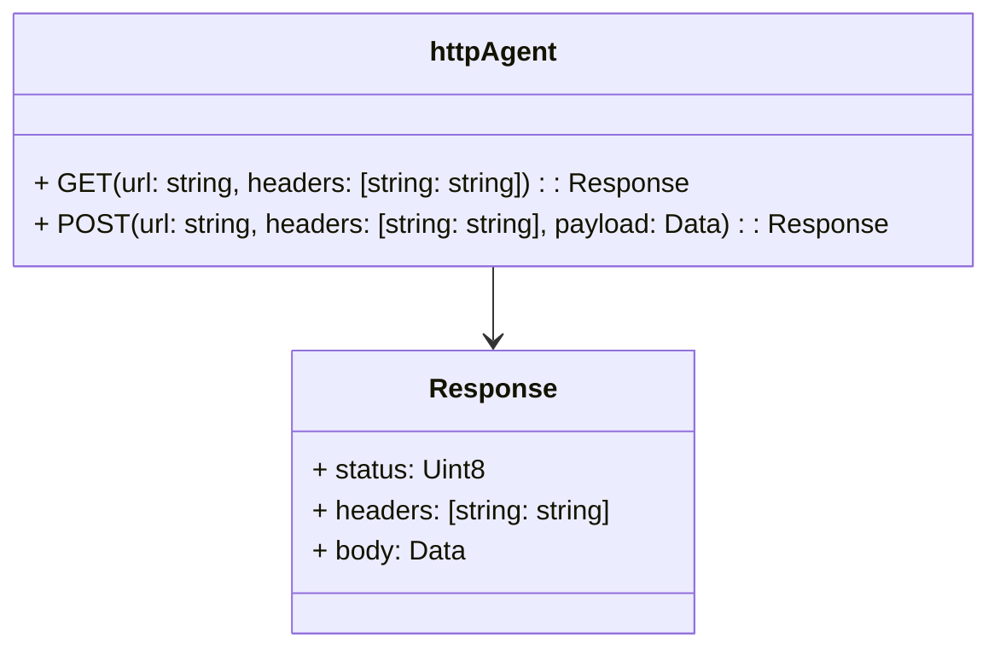

```mermaid

classDiagram

interface httpAgent
class httpAgent {
    + GET (url: string, headers: [string: string]) : Response
    + POST (url: string, headers: [string: string], payload: Data) : Response
}

class Response {
    + status: Uint8
    + headers: [string: string]
    + body: Data
}

httpAgent --> Response

```
And we'll have to handle form-URL encoding for presentation. 